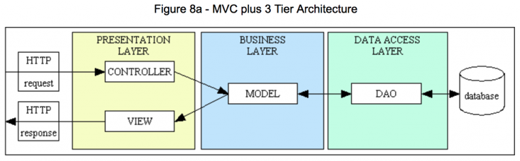

# Servlet MVC Practice 🧩

Spring을 학습하기에 앞서, Servlet을 활용하여 MVC 패턴의 서버 구조를 직접 구성해본 학습용 프로젝트입니다.

---

## 🧱 프로젝트 구조

 <!-- 이미지 경로는 실제 위치에 따라 수정 -->

---

## 📂 패키지 계층별 구성

### 📌 Presentation

#### ✅ Request
- 클라이언트의 HTTP 요청을 **Servlet**이 받아 처리합니다.
- `@WebServlet` 어노테이션을 사용하여 URL 패턴과 서블릿을 매핑합니다.
- 요청 정보는 `HttpServletRequest` 객체를 통해 전달받습니다.

#### ✅ Response
- 처리 결과를 `HttpServletRequest`에 `setAttribute()`로 저장한 뒤,
- `RequestDispatcher`를 이용하여 **JSP로 포워딩**하여 사용자에게 결과를 출력합니다.
- JSP는 **View의 역할**만 담당하며, 비즈니스 로직은 포함하지 않고 화면 구성만 수행합니다.
- JSP에서는 `${}` 문법 등을 사용하여 request 범위의 데이터를 출력합니다.

---

### 📌 Business

#### ✅ Domain
- 도메인 모델(`Member`)은 데이터베이스의 `MEMBER` 테이블과 매핑되는 자바 객체입니다.
- 회원 정보를 표현하는 데이터 구조로 사용되며, 주로 Service와 DAO 간의 데이터 전달에 활용됩니다.

#### ✅ Service
- `service` 패키지에는 실제 **비즈니스 로직을 처리하는 클래스**가 위치합니다.
- 컨트롤러(Servlet)로부터 요청을 받아 필요한 작업을 DAO를 통해 처리하며, 결과를 다시 컨트롤러에 전달합니다.
- 트랜잭션 처리, 조건 분기, 예외 처리 등의 **핵심 로직**이 이 계층에서 수행됩니다.

---

### 📌 DataAccessLayer

#### ✅ DAO (Data Access Object)
- `dao` 패키지에는 각 테이블에 대응하는 DAO 클래스가 위치합니다.
- DAO 클래스는 **SQL 실행**, **ResultSet 처리**, **자원 정리(close)** 등의 역할을 담당합니다.

---

## 🏗 DaoFactory를 활용한 책임 분배 및 관심사 분리

- `ConnectionProtocol` 인터페이스를 생성하여  
  - Connection 객체를 전달하는 `getConnection` 함수와  
  - 리소스를 닫아주는 `closeResource` 함수를 선언하였습니다.  
    
    ``` java
    public interface ConnectionProtocol {  
        public Connection getConnection () throws SQLException, ClassNotFoundException;  
        public void closeResource(ResultSet rs, PreparedStatement pstmt, Connection conn);  
    }
    ```

- `ConnectionProtocol`을 구현한 `MemberConnectionProtocol` 클래스를 생성하고, 해당 interface의 기능을 구현하였습니다.  
  
    ```java
    public class MemberConnectionProtocol implements ConnectionProtocol {  

        @Override  
        public Connection getConnection() throws SQLException, ClassNotFoundException {  
            Class.forName("oracle.jdbc.driver.OracleDriver");  
            return DriverManager.getConnection("jdbc:oracle:thin:@localhost:1521/xepdb1", "hun", "3469");  
        }  

        @Override  
        public void closeResource(ResultSet rs, PreparedStatement pstmt, Connection conn) {  
            try {  
                if (rs != null) rs.close();  
                if (pstmt != null) pstmt.close();  
                if (conn != null) conn.close();  
            } catch (SQLException e) {  
                e.printStackTrace();  
            }  
        }  
    }
    ```

- `DaoFactory`에서는 `ConnectionProtocol` 구현체를 생성자 파라미터로 주입받아 `MemberDao` 객체를 생성하도록 구성하였습니다.  

    ``` java
    public class DaoFactory {  
        public MemberDao memberDao() {  
            return new MemberDao(new MemberConnectionProtocol());  
        }  
    }
    ```

---

## 📝 느낀점

- DaoFactory를 통해 DAO 객체를 생성할 때, 의존 객체인 `ConnectionProtocol`을 주입받는 구조를 직접 구현해보았습니다.  
  이를 통해 Spring의 핵심 개념인 IoC(Inversion of Control)와 DI(Dependency Injection)를 실습 차원에서 체험할 수 있었습니다.  
  해당 구조를 구현하면서 객체 간의 결합도를 낮추고, 유지보수성과 확장성이 높은 아키텍처의 설계에 대한 감각을 익힐 수 있었습니다.
